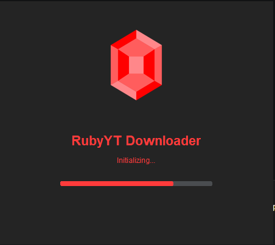
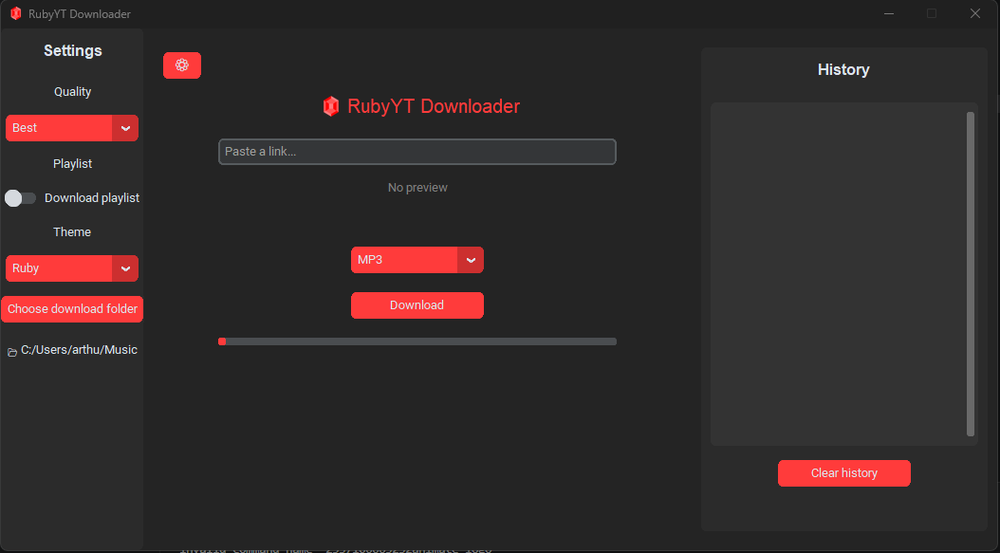
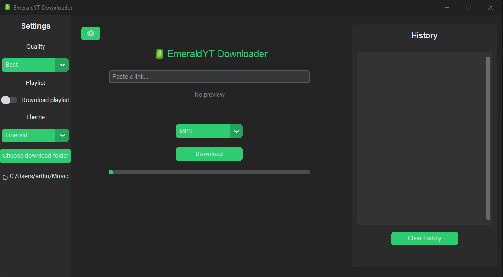
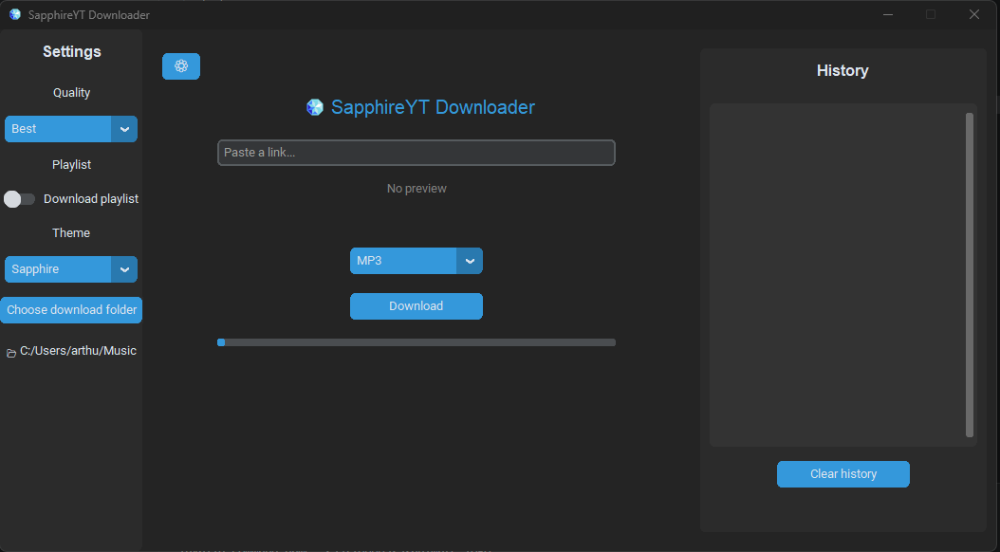
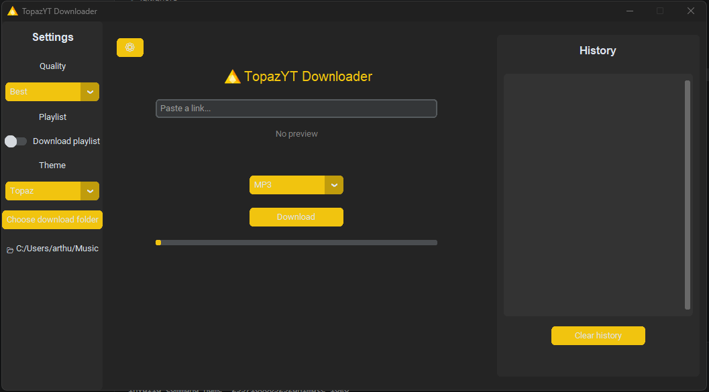
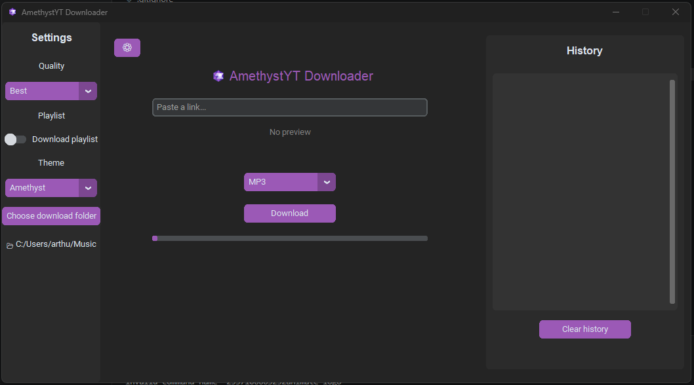

# 💎 GemYT Downloader

> 🚀 Multi-platform downloader with a modern gem-themed interface

---

## ✨ Features

✔ Download from multiple platforms:

- 🎥 YouTube  
- 🎧 Spotify *(auto-converted via YouTube)*  
- ☁️ SoundCloud  
- 📱 TikTok  
- 📸 Instagram  
- 🐦 Twitter  

✔ MP3 / MP4 support  
✔ Playlist support ✅ *(NEW)*  
✔ Video preview (title + thumbnail) ✅ *(NEW)*  
✔ Download progress bar ✅ *(NEW)*  
✔ Download history ✅ *(NEW)*  
✔ Custom download folder  
✔ Modern UI with themes  
✔ Fast & lightweight  

---

## 🖥️ Preview

### 🚀 Loading Screen


---

## 💎 Themes

### 🔴 Ruby


### 🟢 Emerald


### 🔵 Sapphire


### 🟡 Topaz


### 🟣 Amethyst


---

## 📥 Download

👉 Go to the **Releases** tab and download the latest version:

➡️ `GemYT.exe`

---

## ⚙️ Installation (for developers)

```bash
pip install -r requirements.txt
python main.py
